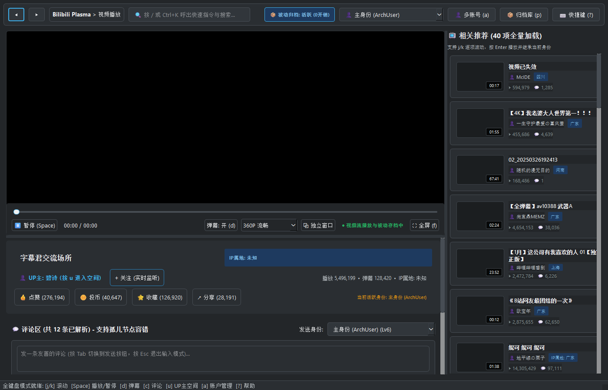
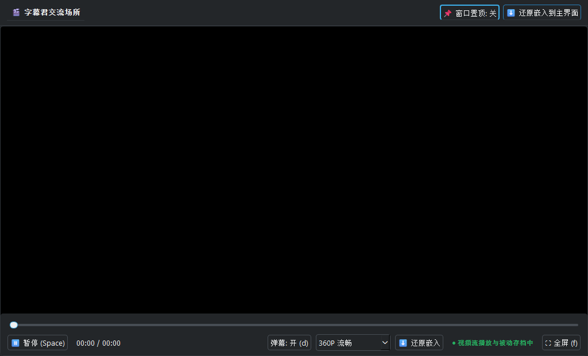
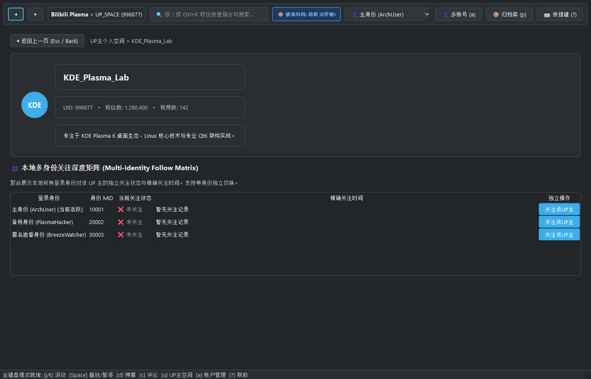
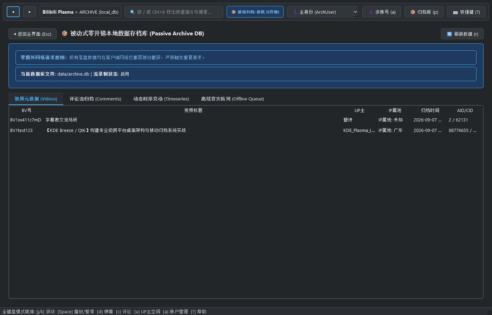
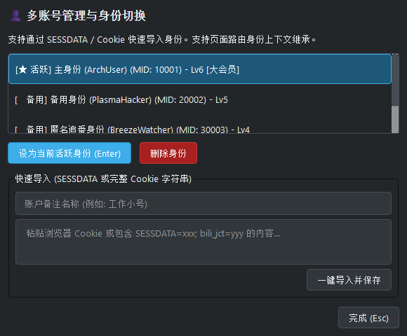
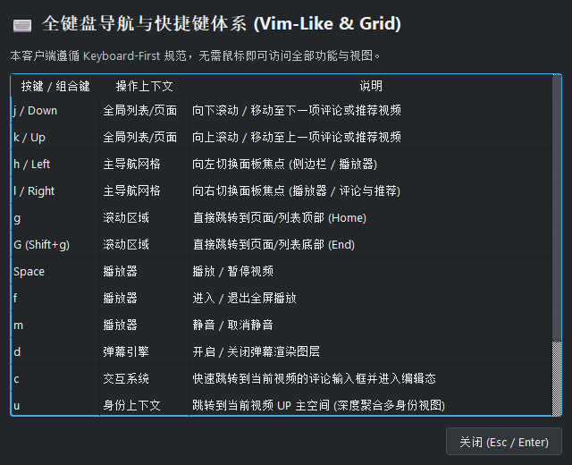

# Bilibili KDE Plasma / Breeze Desktop Client

[English Documentation](README_EN.md) | [中文说明](README.md)

> [!IMPORTANT]
> **AI-assisted development notice:** Google Gemini assisted the design and implementation of this project. The repository retains the [original prompt](gemini-code-1788748840030.md). The maintainer reviewed the resulting work and remains responsible for the published content.

[](LICENSE)
[](https://www.python.org/)
[](https://www.qt.io/)
[](https://kde.org/)

A professional, high-performance Bilibili desktop client built with **Python 3.13** and **Qt6 (PySide6)**. The UI and interactions strictly adhere to **KDE Plasma 6 / Breeze** visual specifications, featuring **Keyboard-First navigation**, **multi-identity context state inheritance**, **zero-overhead passive local data archiving**, **robust orphan-fallback comment trees**, **native hardware-accelerated video stream decoding**, and **dual-axis resizable splitters with a detachable picture-in-picture (PiP) window**.

---

## 📸 Interface Screenshots

### 1. Main Player View & 40 Recommendations
> Adheres to the KDE Breeze Dark palette, featuring native hardware-accelerated video decoding, high-performance danmaku overlay rendering, standard 40 recommendation cards, and robust comment tree hierarchy.



### 2. Detached Standalone Window & Picture-in-Picture (PiP)
> Clicking `⧉ Pop-out Window` instantly detaches the player into an independent top-level desktop window, supporting free drag-resizing, multi-monitor placement, and `📌 Pin on Top (Always on Top)`.



### 3. UP Space Deep View: Multi-Identity Follow Matrix
> Aggregates follow states and exact second-level timestamps across all configured local accounts, enabling independent follow toggles per account.



### 4. Passive Local Data Archive SQLite Inspector
> Zero-extra-network-request principle: passively intercepts responses at the network layer and asynchronously writes to SQLite, tracking video metadata, time-series metrics (likes/coins/favorites), and full comment threads.



### 5. Multi-Account Identity Manager & Cookie Importer
> Adheres strictly to Default Value Semantics, supporting rapid import via `SESSDATA` / Cookie string with identity isolation and page routing inheritance.



### 6. Full Keyboard Navigation Reference Overlay
> Press `?` or `F1` anytime to display the complete Vim-like and focus grid navigation cheat sheet.



---

## ✨ Key Features

1. **Native Video Hardware Acceleration & Anti-Leech Stream Proxy (`LocalStreamProxy`)**
   - Integrates Qt6 native `QMediaPlayer` + `QAudioOutput` + `QVideoWidget`, powered by the built-in **FFmpeg 7.1.5** engine, supporting H.264, HEVC, AAC decoding, and stereo output.
   - Built-in lightweight local reverse proxy dynamically injects `Referer: https://www.bilibili.com` to bypass CDN HTTP 403 Forbidden checks, and supports HTTP 206 Partial Content Range requests for instantaneous scrubbing.

2. **Dual-Axis Draggable Resizing & Detachable Pop-out Window**
   - **Horizontal Splitter (QSplitter)**: Drag left/right to adjust the ratio between the video player and the 40 recommendation cards.
   - **Vertical Splitter (QSplitter)**: Drag up/down to stretch the video viewport vertically.
   - **`⧉ Pop-out Window`**: Detaches into an independent desktop window with Always-on-Top pinning; closing it seamlessly re-embeds the player back into the main window without interrupting playback.

3. **Passive Zero-Overhead Local Data Archiving**
   - **Zero Extra Network Request Principle**: Data is passively intercepted at the client response layer; duplicate queries to Bilibili APIs are strictly prohibited.
   - Flexible path templating via `config.yaml`: `{aid}`, `{bvid}`, `{cid}`, `{upid}`, `{title}`, `{timestamp}`.
   - SQLite tables: video metadata, dynamic time-series log table (likes, coins, favorites over time), comments stream, and stream chunk recording.

4. **Multi-Identity & Context State Inheritance**
   - Page transitions strictly inherit the active identity of the previous page context.
   - Isolated operations: Comments, danmaku, likes, and follows can be independently executed using any configured identity without altering the active global page identity.
   - Real-time follow event listener: triggers an automatic greeting message prompt adhering to Default Value Semantics.

5. **Robust Comment Tree with Orphan Fallback**
   - Reconstructs flat API payloads into hierarchical nested tree structures.
   - **Graceful Orphan Fallback**: When parent comments are deleted, moderated, or unpaginated, synthetic placeholder parents are created with a `[Original Comment Deleted]` badge, preventing crashes or rendering disruptions.

6. **Multi-Layer Danmaku Engine**
   - Supports rolling, top-fixed, and bottom-fixed danmaku with high-contrast outlined anti-aliased rendering.
   - Full support for Mode 7 2D/3D code danmaku coordinate interpolation and alpha fading.
   - Full support for BAS (Bilibili Advanced Script) dynamic timeline scripts.

---

## ⌨ Keyboard Navigation Cheat Sheet (Press `?` or `F1`)

| Key | Mode / Scope | Description |
| :--- | :--- | :--- |
| `j` / `Down` | List / Viewport | Scroll down comments or recommendations |
| `k` / `Up` | List / Viewport | Scroll up comments or recommendations |
| `h` / `Left` | Panel Grid | Shift focus left (player / sidebar) |
| `l` / `Right` | Panel Grid | Shift focus right (player / comments & recommendations) |
| `g` | Scrollable | Jump to top (Home) |
| `G` (Shift+g) | Scrollable | Jump to bottom (End) |
| `Space` | Player | Play / Pause video |
| `f` | Player | Toggle Fullscreen |
| `d` | Danmaku Engine | Toggle danmaku overlay on / off |
| `c` | Interactions | **Jump to comment input box and enter edit mode** |
| `u` | Identity Context | **Jump to UP Space (Multi-Identity follow matrix)** |
| `a` | Identity System | Open Multi-Account Manager modal |
| `p` | Archiving System| Open Passive SQLite Archive Inspector |
| `/` or `Ctrl+K` | Global Commands | Open KRunner / Command Palette |
| `Esc` | Global | Exit edit mode / dismiss popup / navigate back |

---

## 📦 Quick Start & Usage

### Method A: Run Precompiled Executables (Recommended)

Pre-built Windows binaries are available in `dist/`:
- **Standalone Portable Version**: `dist/BilibiliPlasma-Standalone.exe` (Single file, embedded FFmpeg/Qt6 runtime)
- **Extracted Folder Version**: `dist/BilibiliPlasma/BilibiliPlasma.exe` (Fast startup, editable `config.yaml` alongside executable)

### Method B: Run from Source

```powershell
# 1. Clone repository
git clone https://github.com/<your-username>/bilibili-plasma-desktop.git
cd bilibili-plasma-desktop

# 2. Install dependencies
pip install -r requirements.txt

# 3. Launch application
python main.py

# Optional parameters
python main.py --bvid BV1xx411c7mD   # Specify initial video
python main.py --offline             # Offline simulation mode
python main.py --test-run            # CI automated health check
```

---

## 🧪 Automated Unit Tests

Complete test suite covering orphan comment fallback, passive SQLite archiving, multi-identity state machine inheritance, and BAS danmaku parsing:

```powershell
python -m unittest discover tests
```

*Output: Ran 12 tests in 3.048s — OK.*

---

## 📄 License

This project is licensed under the permissive [MIT License](LICENSE). You are free to use, modify, distribute, and sublicense it for personal or commercial projects.
